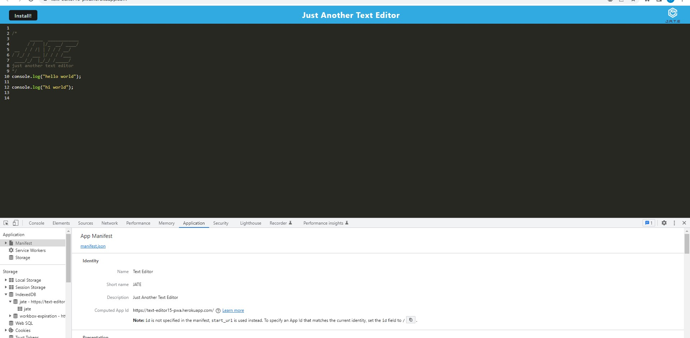

# Project Title

Text_Editor_PWA

[License link: Unlicense](http://unlicense.org/)

# Description

The app is a text editor. It's a single page application that meets the PWA criteria Additionally, it will feature a number of data persistence techniques that serve as redundancy in case one of the options is not supported by the browser. The application will also function offline.

# Table of Contents

- [User-Story](#User-Story)
- [Acceptance-Criteria](#Acceptance-Criteria)
- [Installation](#Installation)
- [Usage](#Usage)
- [License](#License)
- [Resources](#Resources)
- [Contributing](#Contributing)
- [Tests](#Tests)
- [Contact Information](#Contact-Information)

# User-Story

AS A developer  
I WANT to create notes or code snippets with or without an internet connection  
SO THAT I can reliably retrieve them for later use

# Acceptance-Criteria

GIVEN a text editor web application  
WHEN I open my application in my editor  
THEN I should see a client server folder structure  
WHEN I run `npm run start` from the root directory  
THEN I find that my application should start up the backend and serve the client  
WHEN I run the text editor application from my terminal  
THEN I find that my JavaScript files have been bundled using webpack  
WHEN I run my webpack plugins  
THEN I find that I have a generated HTML file, service worker, and a manifest file  
WHEN I use next-gen JavaScript in my application  
THEN I find that the text editor still functions in the browser without errors  
WHEN I open the text editor  
THEN I find that IndexedDB has immediately created a database storage  
WHEN I enter content and subsequently click off of the DOM window  
THEN I find that the content in the text editor has been saved with IndexedDB  
WHEN I reopen the text editor after closing it  
THEN I find that the content in the text editor has been retrieved from our IndexedDB  
WHEN I click on the Install button  
THEN I download my web application as an icon on my desktop  
WHEN I load my web application  
THEN I should have a registered service worker using workbox  
WHEN I register a service worker  
THEN I should have my static assets pre cached upon loading along with subsequent pages and static assets  
WHEN I deploy to Heroku  
THEN I should have proper build scripts for a webpack application

# Installation

The user can either click the heroku link that's provided below or, they can clone the code and run "npm run start" and then switch over to the browser and got to "localhost:3000" to see the output

# Usage

Once the user runs the app they can type whatever they want and have it saved automatically even if they're offline

# Credits

UofT bootcamp starter code and UofT bootcamp class notes

# License

Unlicense

# Resources

Github Repo Link: https://github.com/hovigmk/Text_Editor_PWA  
Github Deployed Link: https://hovigmk.github.io/Text_Editor_PWA/  
Heroku Link: https://text-editor15-pwa.herokuapp.com/

Screenshots:

# Contributing

They can use it to have a text saved and edited if needed or they can edit it and use it to save other things.

# Tests

NA

# Contact Information

- GitHub Username: [hovigmk](https://www.github.com/hovigmk)
- Contact Email: hovigkalayjian@gmail.com
